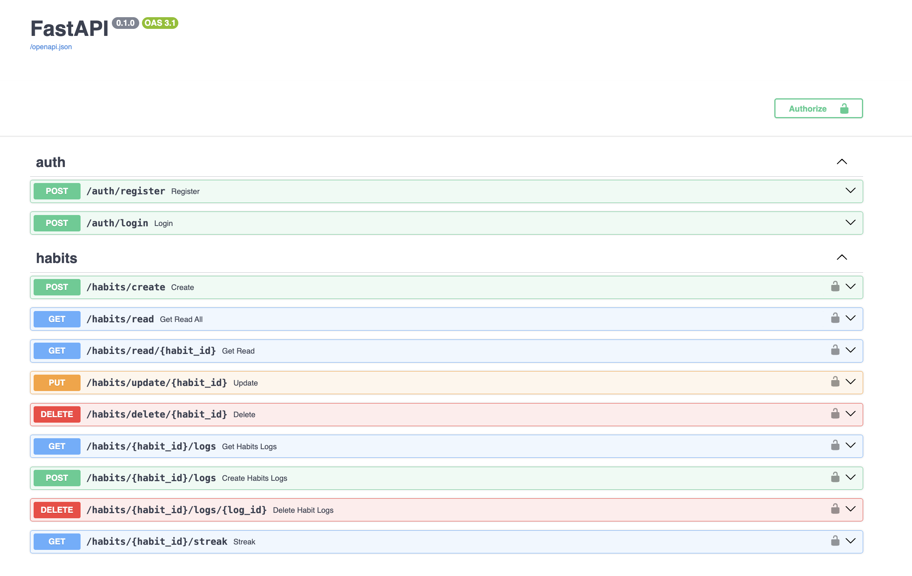
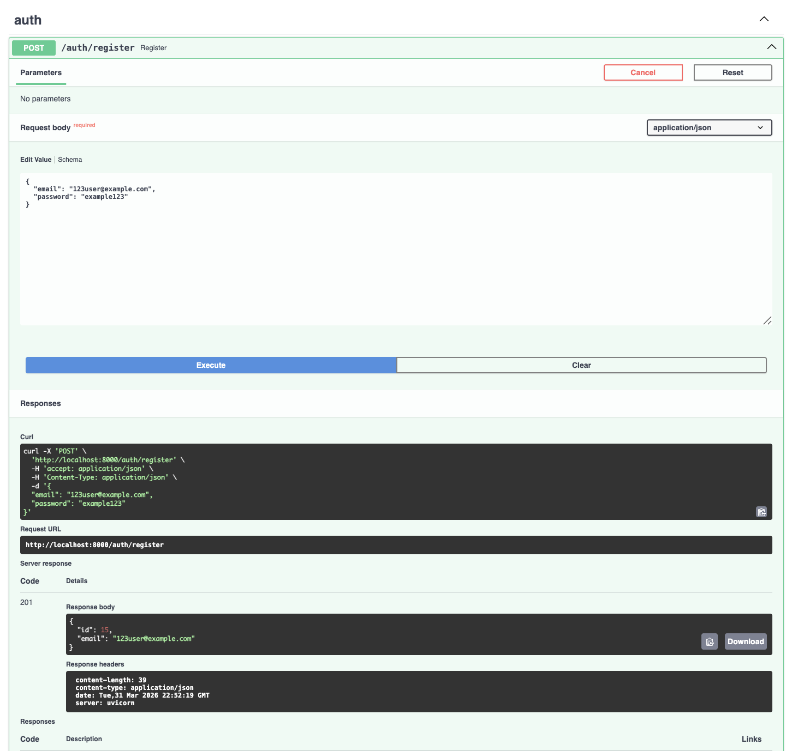

# Habit Tracker

REST API project for tracking and counting habits.

## Stack

- Python
- FastAPI
- SQLAlchemy (async)
- PostgreSQL
- Pydantic
- Alembic
- Docker
- Pytest
- JWT Authentication

## Features

- User registers and authenticates (JWT + refresh token)
- Create/read/update/delete habits
- Track daily habit completion
- Calculate streak

## Screenshots




## Launch with Docker

1. Clone the repository
2. Create `.env` file (see `.env.example`)
3. Run:
```bash
docker-compose up --build
```

API: `http://localhost:8000`
Swagger: `http://localhost:8000/docs`

## Local Development
```bash
pip install -r requirements.txt
alembic upgrade head
uvicorn app.main:app --reload
```

## API Endpoints

### Auth
- `POST /auth/register` - Register a new user
- `POST /auth/login` - Login and get tokens

### Habits
- `GET /habits/read` - Get all habits (with pagination)
- `GET /habits/read/{habit_id}` - Get habit by ID
- `POST /habits/create` - Create a habit
- `PUT /habits/update/{habit_id}` - Update a habit
- `DELETE /habits/delete/{habit_id}` - Delete a habit

### Habit Logs
- `POST /habits/{habit_id}/logs` - Mark habit as completed
- `GET /habits/{habit_id}/logs` - Get habit history
- `DELETE /habits/{habit_id}/logs/{log_id}` - Delete a log

### Streak
- `GET /habits/{habit_id}/streak` - Get current streak